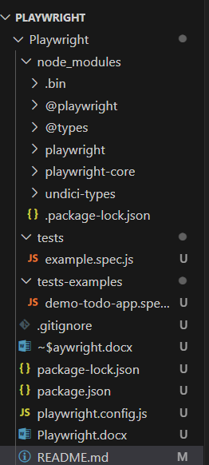
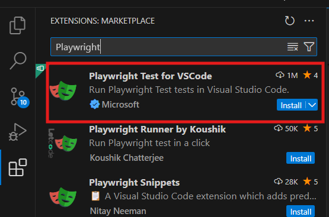
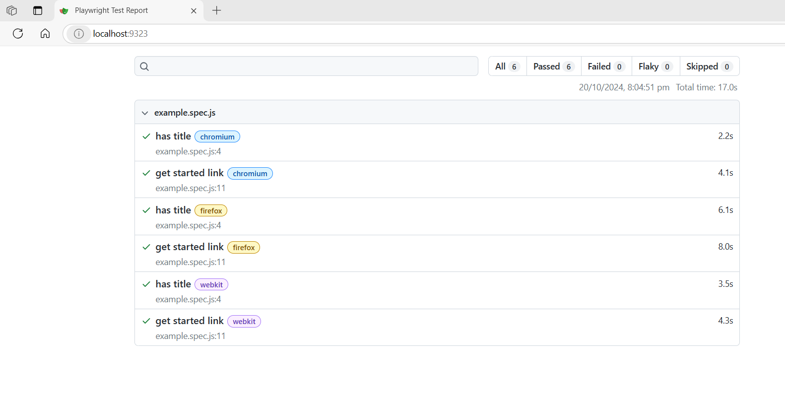

# Playwright
Playwright

# Installation
npm init playwright@latest

# Folder Structure
plawright.config: Configuration file; package.json: Project management file of node js projects

version of playwright installed:  npm playwright -v

Installation:
1) Nodejs
2) VS Code
3) Create project file ---> open in VSCode
4) install playwright using terminal

npm init playwright@latest

package.json ---> node project management file

playwright.config.js ---> playwright configuration

tests ---> we can all teh playwright tests

npm playwright -v ---> return installed version of playwright

5) install playwright using vscode extension

6) Command to run test: npx playwright test

7) By default playwright will execute all the tests in hedles mode: so we will not see any browser launching/UI

8) To run in headed mode: npx playwright test --headed

9) Run Playwright test:
npx playwright test
npx playwright test --headed

npx playwright show-report ---> Will open/Show automatically created reports

# test case
async: keyword make sure the function will return the promise

await: keyword make sure it will wait for the promise

To run specific file: provide path
Example: npx playwright test HomePageTest.spec.js

To execute test only on specific browser/one browser: specify brwoser
Example:  npx playwright test HomePageTest.spec.js --project=chromium

# Create and Run tests commands
1) npx playwright test ---> runs all the tests on all the browsers in headless mode
2) npx playwright test MyTest.spec.js ---> runs a specific test file
3) npx playwright test Mytest.spec.js --project=chromium ---> runs on specific browser
4) npx playwright test MyTest.spec.js --project=chromium --headed ---> runs on specific browser and headed mode
5) npx playwright test Mytest.spec.js --project=chromium --headed --debug ---> runs on specific browser, headed mode and dubuger on
